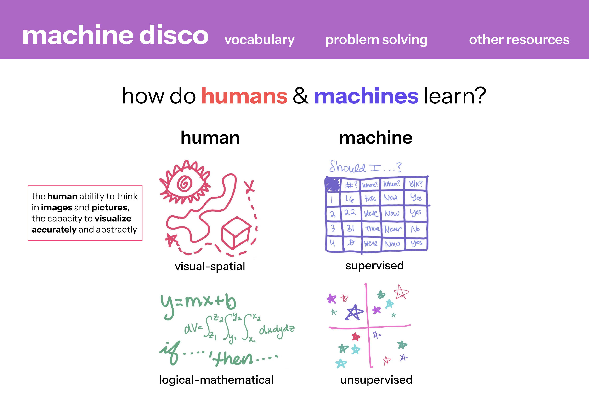
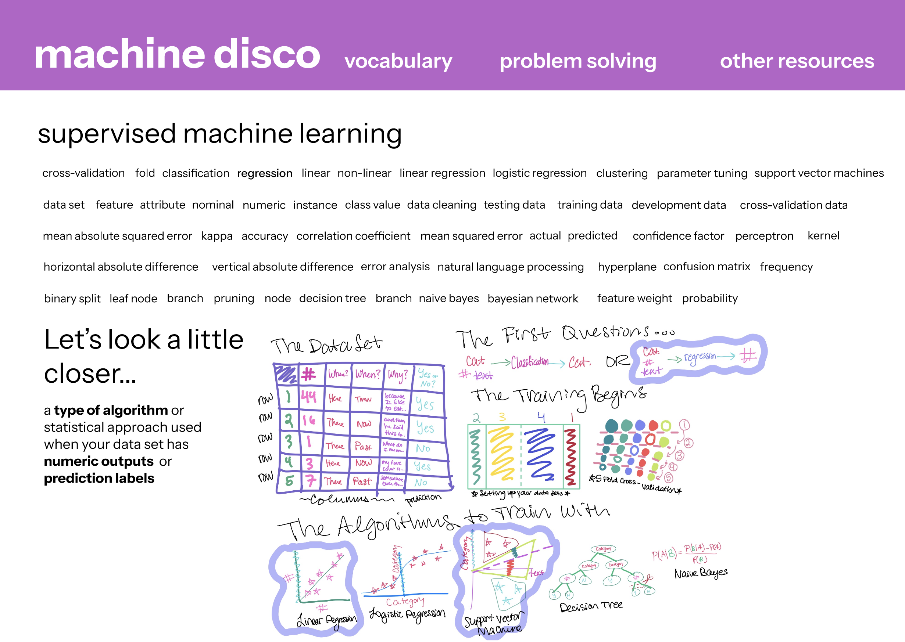
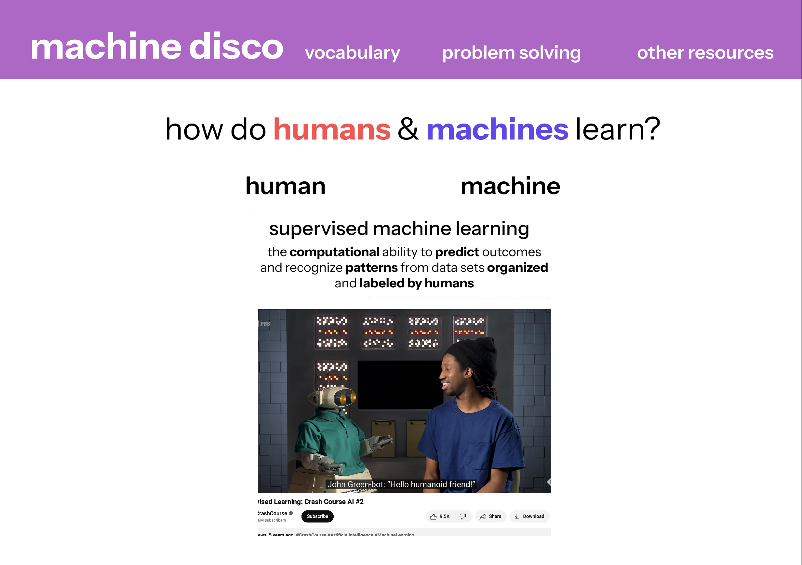
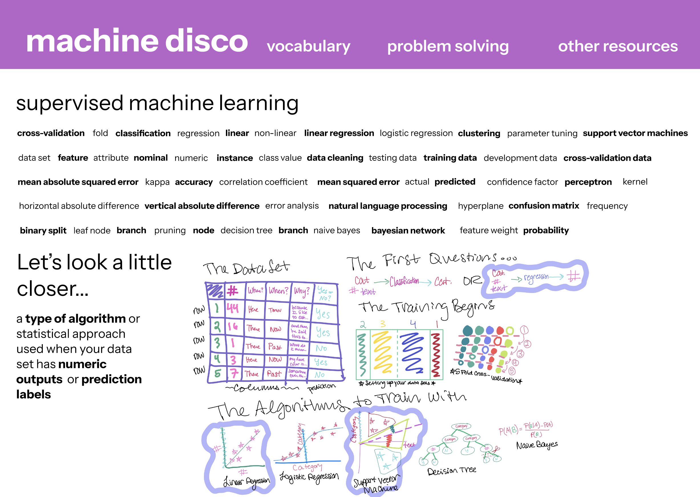
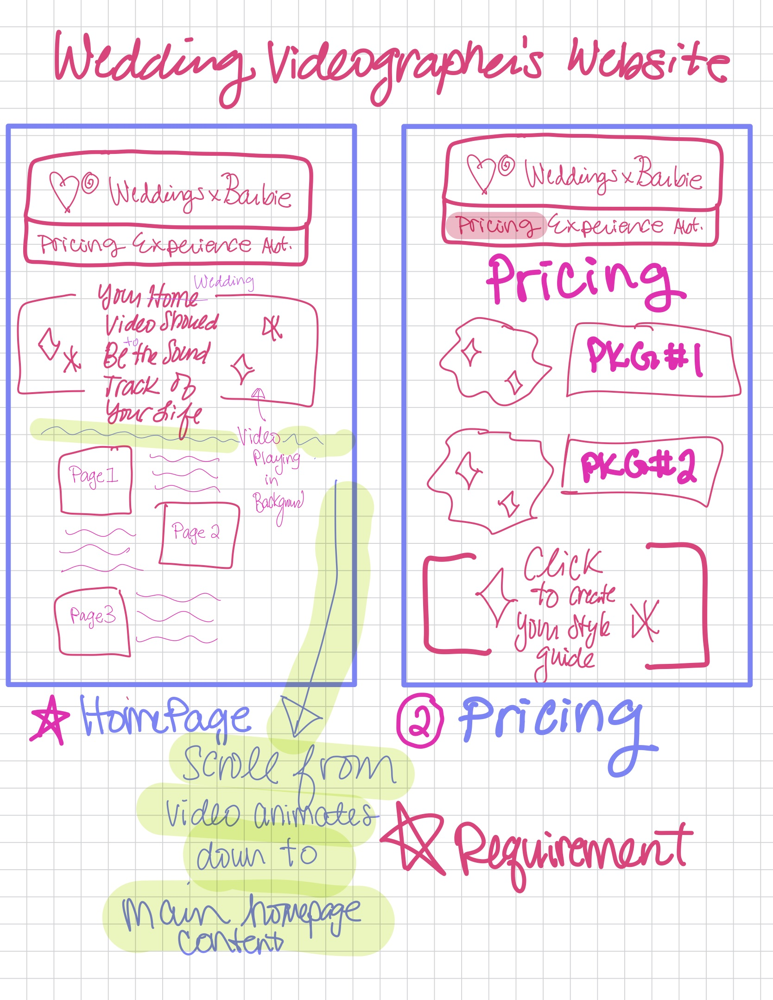
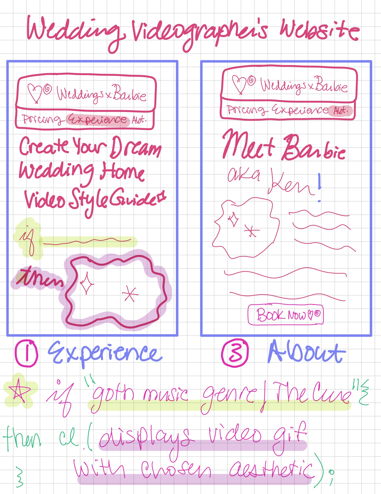
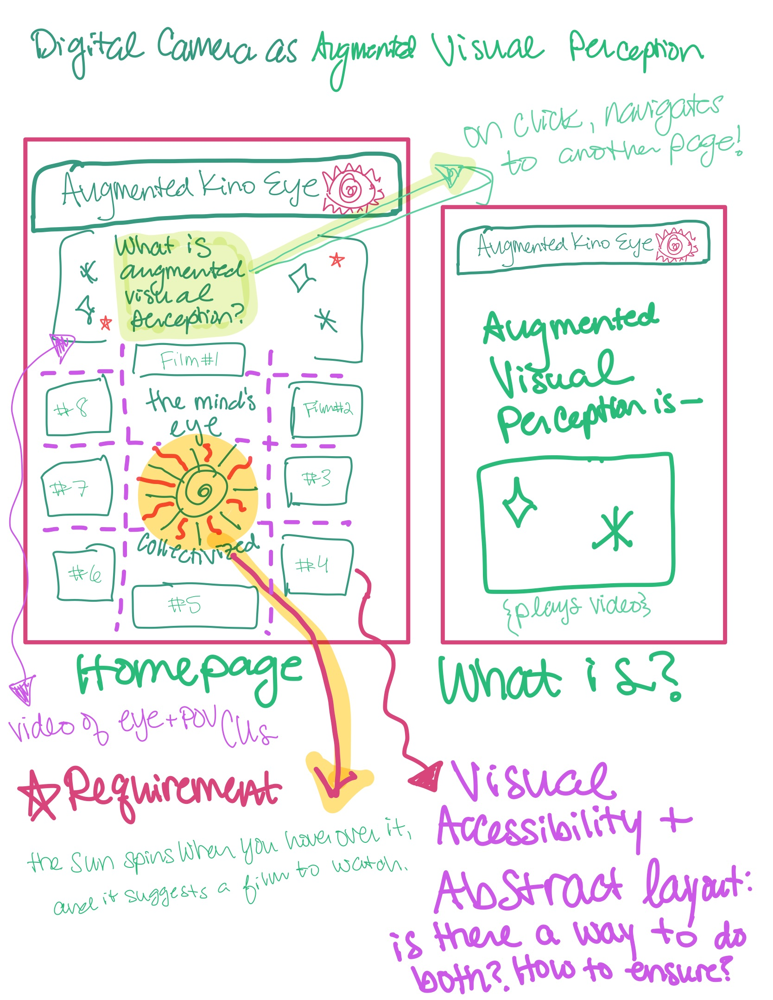
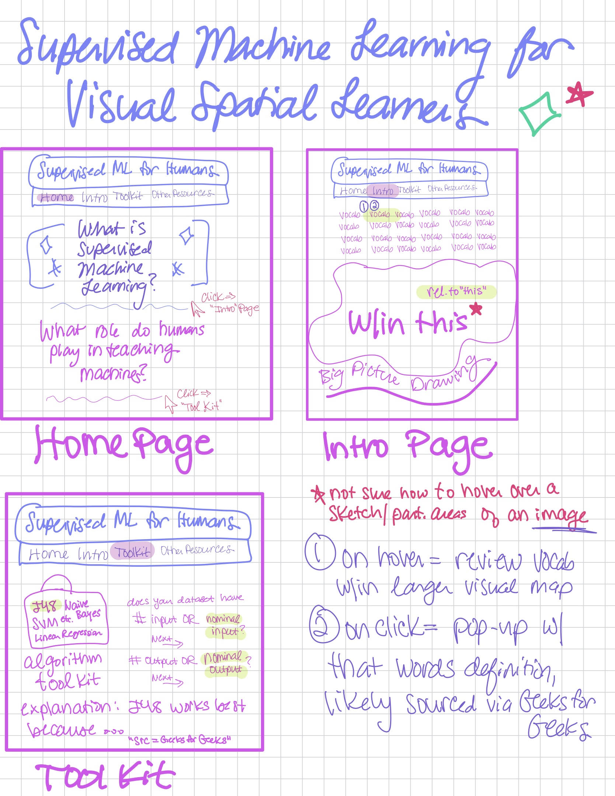

<mark>**Note that this document order from FP4 -> FP1**</mark>

<mark>Please sign up for the study</mark> at [https://tinyurl.com/pui-study](https://tinyurl.com/pui-study) to allow us to use your submission to create a better GenAI assistant for designers!

---

# **FP4 \- Final Project Writeup**

Feel free to refer to this [Markdown Cheat Sheet](https://www.markdownguide.org/cheat-sheet/) to make your writeup more organized, and you can preview your markdown file in VSCode [Markdown editing with Visual Studio Code](https://code.visualstudio.com/docs/languages/markdown#_markdown-preview).

## Part 1: Website Description

In Latin, "disco" translates to "learn" and is related to the French word "discotheque" that is directly translated to "phonograph record, disk." machine disco seeks to educate users on the similarities and differences between types of human and machine intelligences and ways of perceiving the world. machine disco is an artistic interpretation of these binaries between humans and machines or binaries that can be seen within ourselves. The website also explores the ways that humans and machines are similar to one another by personifying machines via the individual learning images included on each detail page. For the activities/music icon, users can see how machines act like humans. For the poem/book icon, users can see how machines attempt to write emotionally, their language inspired by humans. The content of the detail pages was generated by ChatGPT, someone I converse with often.

machine disco's target audience is anyone who is curious about learning something new, is philosophical and enjoys self-reflection. The puzzling nature of the drawings and meanings behind the perception styles, such as "unsupervised perception", are intended to entice the user to continue using the website--despite the confusions, disjunctions and vague explanations that arise throughout the organization of the website's content and interactions.

Initially designed to be a visual learning toolkit to accompany supervised machine learning, machine disco's purpose evolved from the practical to the impractical, but the core idea of the website remains: users are able to primarily engage with written material by first clicking on an image. The most interesting aspect at present is how aloof the website is–while it is usable, it keeps the user guessing on the true meaning of the images, text and overall content synthesis. The hope is that users will leave the site thinking divergently about their relationship to themself and machines.

## Part 2: User Interaction

How a user would interact with your website? For each step, briefly but clearly state the interaction type & how we should reproduce it.

1. Click. Click on the "start dancing" button on the cover page.
2. Click. Click on one of the four perception styles on the glossary page.
3. Click. Click on one of the three doodle icons on the perception detail page.
4. Click. Click on one of the three doodle icons to remove the text from view on the perception detail page.

## Part 3: External Tool

Describe what important external tool you used (JavaScript library, Web API, animations, or other). Following the bulleted list format below, reply to each of the prompts.

1. jQuery

- I chose to use jQuery because I struggled to understand what a library was and which one I should use to implement my original idea (visual toolkit for machine learning), and since I have never programmed before, I thought it would be more useful due to time and energy to start smaller. jQuery was a great first time example of a library because it showed me how simple it was to incorporate a library based on what I already understood of JavaScript--you just download the JS file and organize it within your folders, link it to the proper html page, and double check that jQuery is linked via the console.
- I used jQuery to set-up Textillate to animate the cover page for machine disco.
- Adding jQuery allowed me to use animate.css, lettering.js and textillate.js outside of plain JavaScript.

2. Lettering & Textillate & Animate.CSS

- I decided to use these plug-ins because I was interested in how all 3 of them worked together--it's also interesting to me how each file takes on a separate aspect of the animated text execution (animate = flash, bounce, etc. in the styling; lettering allows each letter to be selected to enable the animation and textillate pulls it all together).
- I used these 3 for the cover page. I also had fun figuring out how to find the correct class for each letter to keep the individuall colored letters I had planned on in my design--I had to dig into the inspect/textillate span class assignments to figure it out.
- The animation simulates the motion and excitement that one thinks of when you see the word "disco," and is a great introduction to the abstractions of the website.

## Part 4: Design Iteration

The pages I created ended up being extrapolations on the original homepage, and I had to omit both the storytelling glossary and the toolkit because I didn't know how to implement them as a first time programmer. While the interactions are limited to clicking and loading the detail pages from an object/params, the final website looks very similar to my prototypes in Figma. My future goal is to keep working on machine disco until it's closer to my original intention, and I would like to approach the design from a research perspective instead of from purely my own thoughts and experiences.

## Part 5: Implementation Challenge

I am the most disappointed in this piece of the reflection--I really hoped to make what I had originally proposed, but I ran out of time, energy and skill. While this feels like a failure, I am also grateful because I think this set-back oriented me to the world/profession of computer science very well. As a designer, it's important to understand the scope of what you are designing and how it will actually be implemented by developers--there seems to be a tension in this type of relationship in the industry between grand ideas and how they can be made possible. I also am shaky on how this website serves the user in its current state because I think it avoids educational heuristics in favor of artistic license.

## Part 6: Generative AI Use and Reflection

In the vein of machine disco, I definitely struggle with algorithmic thinking, and I prefer a top-down approach to learning a new subject, especially ones in STEM. While I generally understood each block of what we learned throughout the class on its own, I had trouble linking everything together when starting a new project, so I frequently asked a top-down query to ChatGPT such as "how would you do this x?" and its response influenced my thought process through the project.

A few times, I copied code directly from ChatGPT that I understood, but wasn't interested in retyping myself. During our lab presentations, I was struck by other students' projects that were more advanced than mine. While I do not think they arrived where they did because of GenAI, I did think it was interesting that they seemed to understand that advanced programming (from my understanding) is linking pieces of functionality together to build something complex. However! You clearly still need to understand the nuances of each piece in order to link them together. I feel like my use of ChatGPT is similar. I asked it to create the function for adding the clicking event listener because some of the symbols in that syntax are too vague and still confuse me, but I understand what each piece of the function means on recognition.

### Usage Experiences by Project Aspects

| ChatGPT | Usage | design - No | plan - Yes | write code - Yes | debug - Yes | content generation - Yes |
| ChatGPT | Productivity | 4 | 6 | 6 | 7 | 4 |

| Perplexity | Usage | design - No | plan - No | write code - No | debug - No | content generation - No |
| Perplexity | Productivity | 4 | 4 | 4 | 4 | 4 |

### Usage Reflection

> Impact on your design and plan

- It matched my expectations and plan in [FP2](#generative-ai-use-plan) in that … For example,
  1. ChatGPT: I was able to get help with creating the content for each perception style (but I modified given examples for the activities based on my preference; the poem was a direct copy since ChatGPT was supposed to be the "author"), and it was helpful for debugging, especially when I was trying to understand how to make each letter modified by textillate a different color (as I had it prior to adding textillate using html spans/ids for css), however, I actually ended up solving the problem myself by looking deeply into the inspect to find the right class to assign a color to and resolved the issue without ChatGPT. It did really help me with my basic understanding of media queries and the event listener function (I get but don't get the =>> (emptly parenthesis thing)... it's too vague to me).
  2. Perplexity: I ended up not using.
- It did not match my expectations and plan in [FP2](#generative-ai-use-plan) in that … For example,
  1. ChatGPT: it ended up being as helpful as I imagined for generating code and debugging, except I was able to use other methods for debugging for what really mattered (inspect, the console, a classmate).
  2. Perplexity: I did not end up using.
- GenAI tool did/did not influence my final design and implementation plan because … For example,
  1. ChatGPT: I think it did influence my final design and implementation plan by giving me more confidence that I could problem solve something unfamiliar to me while under a deadline. What I copied from it initially was ultimately an example (except for the JS event listener) that I learned from and could then modify and replicate on my own. Ultimately, it would probably be faster to just practice more on my own and become fluent in computer than stopping and asking ChatGPT, but for now, it's my top-down query helper when I'm working by myself.
  2. Perplexity: I ended up not using.

> Use patterns

- I accepted the generations when … For example,
  1. ChatGPT: I accepted the generations when it was for content I could modify/approve or it was code that I understood and could verify by using in the project and seeing the result, as well as checking with W3Schools (sometimes their examples are still too confusing without context when you first read the article). I also used it as part of my debugging process, but eventually, I needed it less and less.
  2. Perplexity: N/A
- I critiqued/evaluated the generated suggestions by … For example,
  1. ChatGPT: this tool once suggested I add a class that didn't make sense while troubleshooting the textillate/span single letter color assignment problem. I reviewed my code to confirm my hunch, corrected it, told it what it did was wrong, and was able to get a better response that helped me moving forward.
  2. Perplexity: N/A

> Pros and cons of using GenAI tools

- Pros
  1. ChatGPT: we talk often, so it usually gives me a customized response and understands how I like to receive information.
  2. Perplexity: it immediately verifies websites it pulls information from.
- Cons
  1. ChatGPT: one time it did ask me to do something that didn't make sense, and I checked it. I think I use it as a crutch after looking through all the threads. I think a pattern with me using GenAI is that it gives so much information, I skim it, I take an inspiring piece and go manipulate it further in the world, but I also think I use it to stall or parse topics I am worried about--not because I can't understand them, but because they are yet to be discovered.
  2. Perplexity: I don't use it enough to have it talk to me like a human rather than a robot.

### Usage Log

Document the usage logs (prompts and chat history links) for the GenAI tools you used. Some tools may not have an easy way to share usage logs, just try your best! Some instructions for different tools:

1. ChatGPT
   Toggle Image Text Visibility (https://chatgpt.com/share/67590ab4-a254-800c-8c9c-6533348103db)
   jQuery vs Vanilla JavaScript (https://chatgpt.com/share/67590c2d-5f2c-800c-89f0-08d6abf48c0e)
   Poems on Learning Types (https://chatgpt.com/share/67590c4b-1b14-800c-8cb7-d9071278d742)
   Visual-Spatial Activities Overview (https://chatgpt.com/share/67590c7b-9b68-800c-8b5d-561b04ea89d3)
   Human vs Machine Learning (https://chatgpt.com/share/67590cc7-011c-800c-9fb0-a80b1380c7f9)

2. Perplexity
   N/A

---

# **FP3 \- Final Project Check-in**

Document the changes and progress of your project. How have you followed or changed your implementation & GenAI use plan and why? Remember to commit your code to save your progress.

## Implementation Plan Updates

- [x] Roadblocks. Talked to my TA to modify the project scope and deliverable.

## Generative AI Use Plan Updates

- [ ] No updates.

Remember to keep track of your prompts and usage for [FP4 writeup](#part-6-generative-ai-use-and-reflection).

---

# **FP2 \- Evaluation of the Final project**

## Project Description

My website, machine disco, is intended to teach people that are unfamiliar with machine learning processes the different learning styles machines posses. This is set in contrast with the different learning styles and intelligences humans posses.

machine disco will give an overview of the differences in learning between humans and machines on the home page, and then, start to teach humans the language of machine learning via a visual glossary on the second most important page. The goal is that, eventually (and if they are especially curious), the human user can attempt to train their own supervised machine learning model using a problem solving toolkit included in the site (the third most important page and a flex goal for this final project).

## High-Fi Prototypes

### _Prototype 1_

The purpose of this page is to orient the users in the differences between human and machine learning styles via interactive drawings. The overarching goal is to be able to compare and contrast and apply this abstract thought to the following processes: learning the vocabulary to work through a supervised machine learning problem. The users I interviewed were able to discern the visual information and relevance as well as easily interact with the site via the hover information reveals.

### _Prototype 2_

The purpose of this page is to show the users an overview of how all of the terms in the vocabulary word bank relate to one another with the help of the visual overview/sketch. Users should be able to hover over a term they want to know more about and the site will reveal the textual description of the word, as well as highlight the word's function or position within the visual overview/sketch. The users I interviewed were unclear on how to interact with this portion of the site. User #1 used their familiarity with the hover interaction to try to engage with the information, but was initially confused and put off by the large word bank of text until they discovered the ability to hover. User #2 overlooked the vocabulary word bank and immediately started to look at and parse through the visual overview/sketch presented towards the bottom of the page.

## Usability Test

Both users testing the site interactions for my intial prototype were people who were not familiar with machine learning, from humanities backgrounds and professionally work in the academic publishing industry (one literature, the other film studies).

The home screen and introduction to machine disco was generally simple for each user to interact with via the hover feature over each design. Each enjoyed the playful style of the hand drawn illustrations and described them as adding a "human" element to the site. One user said that it was easier for them to begin hovering over the images to learn more about each one because the layout was similar to a learning module used at their workplace. The first user quickly moved through the hovering aspect of the design and was looking for more information by clicking the images, but this was not considered in my design. The other user parsed through the hover information entirely without an interest in clicking before being prompted to move to the next task. It seemed like an interesting difference between a top-down vs. bottom-up approach to processing the visual and unfamiliar information unique to each users' default/preferred ways of interacting with the visual world (based on knowing them).

They both approached the vocabulary page differently. Not all of the words were live for the prototype, so user #1 scanned the vocab word bank and vocab visual sketch overview trying to find an active defintion based on their knowledge of using the hover to engage with the home page previously. User #2 very interestingly skipped the vocab word bank and went straight to the image. The image was not live for selecting words or aspects of the image during the prototype, so they were not able to understand the purpose of interacting with the site until prompted. Both users said the vocab word bank looked like a paragraph/sentence/overall monolith, and one recommended differentiating the differences between words to make them stand out as words instead of longer syntax structures. The other user said it would be more helpful to be able to interact directly with the image. Both were unsure of how the information would apply to their daily lives but were curious enough to engage with the site.

Overall, working with these users made me rethink how I think the information should be presented versus the information should be presented in a way that, while creative, is still standardized enough to be understood by the user group. The user group is likely to be people unfamiliar with machine learning, so all mental energy should be relegated to the learning tasks--not the interaction tasks. I also was able to see how different learners interpret the information. I am thinking going forward, I need to figure out a different way to layout the information on the vocabulary page, especially considering the overwhelm of the vocabulary word bank.

## Updated Designs

Here is my update of the home page. I added a pop-out that reiterates the definition of the learning style for each of the 4 learning types presented and then included a video of someone else explaining the concept from youtube. Having an outside source explain the different learning styles in a visual way is valuable in that different people will explain concepts in different ways, so using these separate teachers to explain concepts to users will help them connect with the material in a different way than just reading the material. If the video provided doesn't help, they are close enough to youtube via the embed to seek out other materials themselves.

For the word bank update, I am still not sure how to rearrange the layout to make it simpler for the user to perceive all of this dense information at once without breaking up my drawing and overall concept of a one-size-fits all mental map. In order to start to break up and differentiate what I have, I bolded out every other word in order to make them standout within the "paragraph"/block of text that kind of onslaughts the user upon arrival. It is hard to see in the prototype now, but I also have the main visual overview map as a hoverable entity. After working with user #2, I realized the importance to the goal of the site and consideration of different learning styles how important it would be to have the image itself be interactive.

## Feedback Summary

For the homepage, a few suggestions were given based on the users' intuitions--adding a line to visually separate the human learning styles from machine learning styles would diminish the cognitive overload of looking at the familiar and unfamiliar information all at once. Another user recommended adding the ability to keep multiple hovers visible at the same time, so the user could compare and contrast select learning styles as desired. Other users were interested in each drawing enough that they expected to be able to click on the drawing and reveal more information about the different learning styles, however, at the moment, this was not built into my prototype.

For the vocabulary page, one suggestion was to rename the page the glossary, which would make sense and be interesting in contrast with the (eventual) problem solving tool kit page where you need to be able to reference the machine learning terms in order to help make decisions about what to do with the machine learning model. Many of the feedback reflected the confusion around the mass of the word bank, even with the small improvement to the word bank layout. One of the feedbacks given was to potentially break up the monolith of all of the words blending together into pieces, like telling a story of the process itself. Another user said that perhaps the overall idea of keeping the terms together and in relation to each other could still happen at the top of the page, but that then other users could continue to scroll down and process each aspect of the supervised machine learning terms in a process.

I was pretty stumped on how to use Figma to redevelop my vocabulary page prototype outside of my intial ideas after the user testing this weekend, so the advice of my colleagues/users was very helpful. I wish I had more time to research what exactly would be best for this specific project because I think it ultimately requires a lot of care to ensure 1) the visual-spatial learning aspect is designed with integrity and 2) that the machine learning information presented in machine disco is relevant to the targeted user base. I think that my drive to create the project out of my own need and curiousity was good, however, trying to organize the information in a way that is meaningful to others outside of myself is a challenge. Going forward, I am going to attempt the storytelling recommendation as a base goal because I think this way of explaining the information in smaller pieces will be more encouraging to people that don't know as much about machine learning as I do. Then, as a flex goal within or even outside of this course, I would return to my overarching idea of having the big map and using that as the main tool for users to interact with and learn about supervised machine learning. However! I think it would be more useful to include this aspect of the glossary, as I am now calling it, within the problem solving toolkit page. By then, the user would have learned enough about the terms piece-by-piece that having that overarching visual reference sheet would be way less overwhelming. In building out the storytelling glossary page as a base goal, I will likely keep the layers of data set words vs. algorithm words vs. overall supervised machine learning words, but I might simplify them a little bit by removing a few extraneous ones, just for myself to get the project done in the given timeframe and for the user when first learning this schema.

## Milestones

Outline weekly milestones to plan your expected implementation progress until the end of the semester (\~300 words).

### _Implementation Plan_

- [ ] Week 9 Oct 28 \- Nov 1:
  - [x] FP1 due
- [ ] Week 10 Nov 4 \- Nov 8: (18 hours)
  - [ ] FP2 due (8 hours)
  - [ ] Seriously confirm the validity of using a library to help with the image interaction aspect of the vocabulary page (really unsure of how to do this currently) (3 hours)
  - [ ] Gather all of the necessary content (drawings, definitions, storytelling process, video links) for both the homepage and glossary (4 hours)
  - [ ] Practice using the library with the images I draw because I am not sure how they will work together (3 hours)
- [ ] Week 11 Nov 11 \- Nov 15: (12 hours)
  - [ ] FP3 due (3 hours)
  - [ ] layout the html & css of both main pages (4 hours)
  - [ ] understand if I need to have other pages created (ex. one per word on the vocabulary page that will be swapped between hover/click interactions) in order to make the entire thing work (1 hour)
  - [ ] use javascript on the home page interactions including hovers, pop-out of the video information (4 hours)
- [ ] Week 12 Nov 18 \- Nov 22: (15 hours)
  - [ ] use javascript to tell the story of the 3 most important pieces of the supervised machine learning process, inconjunction with the library (the backup would be to incorporate animations at this stage) (5 hours each)
- [ ] Week 13 Nov 25 \- Nov 29: (15 hours)
  - [ ] finish any aspect of this that has overflowed into this week (5 hours)
  - [ ] time permitting, layout the html of the toolkit page and incorporate a js behavior that links an aspect of it to the glossary (5 hours)
  - [ ] time permitting, offer some if/then statements around one example of a dataset you could start to use to train a machine learning model (5 hours)
  - [ ] Thanksgiving
- [ ] Week 14 Dec 2 \- Dec 6: (9 hours)
  - [ ] FP4 due
  - [ ] fill out final overview in this file (3 hours)
  - [ ] make sure everything required to turn in (home page, vocab page) is polished enough to use (6 hours)

### _Libraries and Other Components_

I will be using the svg.js library to ideally manipulate the drawings I produce so that they are interactive with the words in the glossary. Otherwise, I will use svg.js to find an animation workaround to highlight the visual placement of each vocabulary word in the glossary story flow.

## Generative AI Use Plan

### _Tool Use_

- ChatGPT
  - I will use it for organizing my workflow in relation to my project in particular because it can help me make sure I understand the scope of the project, especially parts of the process I am unfamiliar with while balancing the timeline. For example, how long would it take me as a novice to implement a js library using interactive images.
  - I will not use it for directly copying code likely (unless it was automating a process for me, such as typing out all of the vocab words per it's class--not even sure if that's useful to me) because it might not be able to help me with fully understanding why the code I am using works. However, I would likely ask it what a piece of code means so I can folow-up with better sources outside of ChatGPT versus having to hunt through forums or websites trying to directly locate the syntax/etc that is confusing me.
- Perplexity
  - I will use it for checking my understanding of supervised machine learning tools in relation to one another, almost like asking a tutor on the fly. I would prefer Perplexity to ChatGPT for this because it will cite sources so I can go follow-up with those on my own.

### _Responsible Use_

When I interact with ChatGPT, I mostly use it as a way to process my existing thoughts and make connection, as well as to ask it top-down queries to give me a starting point to figure out something I am completely new to and unsure about. I also ask it to help me sort through workflows. I would use Generative AI responsibly by not copying and pasting exactly what it tells me. I would prefer to reinterpret what it has told me in my own words to futher my own understanding. If I did use it in part of my code, I would cite the source and consult an external source such as the MDN website or W3Schools or Substack to see how others would frame the code from a human perspective and why. I would mostly use GenAI as a reference for context while working through my problems, and I would likely not copy anything directly from it, other than (not sure if it could even get to this point at its current state) having it format each word I end up using and all of it's details into a class structure for each word I end up using, for example. I could also see myself using it to synthesize machine learning concepts as needed or to check my own understanding of those concepts in relation to one another because sometimes I get confused and switch them. I would likely use Perplexity to do this since that tool links sources, whereas with ChatGPT, you're relying on information taken from unknown sources.

---

# **FP1 \- Proposal for Critique**

## Idea Sketches

### _Wedding Videographer Portfolio_

Weddings x Barbie is looking to launch their low-budget home video-like wedding videography services for Summer 2025. The proposed website would showcase their pricing packages (#2) and mission statement/about (#3) and allow potential couples to explore stylistic inspiration (#1) before booking with Barbie.

Barbie's main homevideo will play automatically and then scrolling down will animate to the homepage, revealing other key pages. The Experience page would contain an interactive moodboard generator for potential couples to explore ideas.

It would be important for the videos to have clear semantic controls and annotations for users accessing the site via screenreaders and all other haptic and cognitive heuristics will need to be followed so that the automatic video playing or interactive moodboard can be accessed by any and all interested couples.

### _Digital Camera as Augmented Visual Perception_

This site would be a central viewing space for a final project for the Augmenting Intelligence class entitled "Digital Camera as Augmented Visual Perception" and would showcase an array of individual films inspired by the same prompt. The site would also seek to explain the concept of augmented visual perception.

The sun in the center of the homepage would spin upon click to randomly select a video play suggestion for the user. Carefully placed and labeled video slots within the CSS flexbox would be important to spatially orient the multitude of videos. In order to be fully accessible, the videos would need to be laid out and organized for a screen reader to navigate without being cumbersome and there would need to be a navigation bar introduced to move through the site as expected.

### _Supervised Machine Learning for Visual-Spatial Learners_

This site would create a toolkit that facilitates a mixture of top-down and bottom-up thinking for anyone approaching a supervised machine learning problem. The intro page would provide a hand-drawn concept map giving an overview of all of the technical terminology encountered in a supervised machine learning problem. Upon hovering over a vocab word, the corresponding concept within the hand-drawn map would also be highlighted. Clicking on the vocab word would provide a pop-up box giving a definition.

The toolkit page would provide a series of if/then statements that would help the user think through the process of working with their dataset by narrowing down the algorithms that would most likely match their dataset. Like most of the proposed designs, I would need to be careful to ensure that the visual information is screen reader accessible at minimum with greater thought put into cognitive and haptic abilities.

## Feedback Summary

The feedback I received was as follows:

#1-- didn't generate any feedback, feels the most safe/least novel out of all of the ideas.

#2-- have all of the videos displayed play simultaneously, as long as they do not have corresponding audio (they cautioned that would be overwhelming). Make sure to ask both professors if it would be allowed to create a website in one class for a class project in another class.

#3-- should be able to use an API & flexbox to take the user input for the mindmap/vocab hover and click, as long as you call the API correctly, could create a class for the mindmap (not sure if I translated the notes correctly). for the homepage content, start with an image describing the difference between visual-spatial/top-down and linear/bottom-up learning processes. Make sure that learning or understanding the content doesn't overshadow your process of building the website considering the timeline/turnaround for the project (~5-6 weeks at this point); also maybe instead of focusing the content to this particular supervised machine learning class, think about machine learning vocabulary that has been introduced to the general public in the last year. Try using the Orbit Control animation from p5.js for the mindmap page.

## Feedback Digestion

I will take the advice not to continue working on any type of portfolio, however, I would likely return to project #1 in the future. I think whatever interactive visuals I create between #2 and #3 will help me create the Experience Moodboard idea for that site. In order to continue with #2, I would need to check in with both professors, and I plan on attending office hours this week to do so because I am torn between my remaining 2 ideas. #2 would be a challenge to ensure accessibility, but the content would be easy to simulate, so the focus would be on ensuring peak usability for a visual-heavy site. #3 seems the most direct and interesting out of all of my ideas and could easily incorporate both an API, library and animation. I would likely need to scale down from the greater idea to a smaller scope to complete this project in the given timeframe. Moving forward, I will still check-in for permission to use idea #2, but I will likely move forward with setting up a smaller scope for idea #3 that focuses on the homepage and the intro page. I will also review my understanding of the supervised machine learning vocabulary versus machine learning vocabulary that is available to the general public. I am excited to incorporate all of the feedback given for this design.
